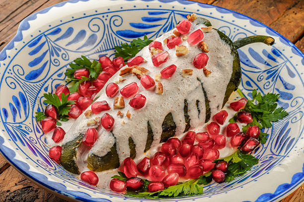

# Receta de cocina - Chiles en Nogada

## Ingredientes
### Para el relleno
1 cucharada de KNORR® Caldo de costilla

3 cucharadas de aceite vegetal

1/4 de cebolla finamente picada

1 diente de ajo

200 gramos de carne molida de res

200 gramos de carne molida de cerdo

1 manzana amarilla pelada y cortada en dados de 1/2 cm

1 pera de Anjou, cortada en dados de 1/2 cm

1 cucharada de pasas güeras

1 cucharada de piñones blancos o rosados

1/2 cucharadita de mezcla en partes iguales de pimienta negra, comino, canela, pimienta gorda y clavo en polvo

2 cucharadas de Knorr® Tomate Deshidratado

1/2 taza de agua

### Para la Nogada

300 gramos de nuez de Castilla

1 cucharada de azúcar

1 pizca de nuez moscada en polvo

1/4 taza de crema reducida en grasa

### Para los Chiles
6 chiles poblanos grandes, asados, sin piel y sin semillas

1 taza de granada limpia

1 cucharada de perejil para decorar

## Método de preparación
1.- Para el relleno, calentar el aceite en una sartén grande, sofreír la cebolla y el ajo hasta que queden transparentes. Agregar la carne y cocinar hasta que tome color.

2.-Agregar la manzana, pera, pasas, piñones y mezcla de condimentos. Sazonar con el Knorr® Caldo de Costilla incorporando todos los ingredientes Cocinar 3 min.

3.-Mezclar Knorr® Tomate Deshidratado con el agua y combinarlo en la preparación anterior. Dejar que se integren todos los ingredientes y que se espese ligeramente. Aprox 3 minutos más.

4.-Para la Nogada, licuar la nuez, azúcar, nuez moscada y crema. Si es necesario, agregar un poquito de leche descremada para obtener una consistencia más ligera.

5.-Rellenar los chiles repartiendo uniformemente la carne en las 6 piezas.

6.-Servir el chile bañado parcialmente con la nogada, esparcir la granada encima y decorar con las hojas de perejil.

## Consejos

1.-Para conservar la nuez de castilla sin que se ponga obscura, remoja en leche hasta que la utilices.

2.-Para preparar la nogada en otra temporada que no hay nuez de Castilla, puedes usar almendras peladas y molidas que le darán un sabor delicioso.
